# XeroxAV.7

Aplicação web full-stack desenvolvida para modernizar e otimizar o gerenciamento de serviços gráficos, pedidos e fluxos de atendimento através de uma plataforma responsiva, escalável e orientada para ambiente de produção.

<p align="center">
  <a href="https://xeroxav7.tech">
    
  </a>
  
</p>

---

# Visão Geral

O XeroxAV.7 foi criado com o objetivo de oferecer uma experiência moderna para gerenciamento de serviços gráficos, pedidos e fluxo de clientes, utilizando uma arquitetura robusta e preparada para evolução contínua.

O projeto vem sendo utilizado como principal ambiente de estudo e desenvolvimento prático em áreas como:

- Engenharia de software
- Desenvolvimento backend
- Arquitetura de sistemas
- APIs REST
- Deploy em cloud
- Estruturação full-stack
- Escalabilidade de aplicações

---

# Tecnologias Utilizadas

## Backend
- Java
- Spring Boot
- APIs REST
- JWT Authentication

## Frontend
- React
- JavaScript
- Interface Responsiva

## Banco de Dados
- PostgreSQL
- Modelagem Relacional

## Infraestrutura & DevOps
- Docker
- AWS
- Git & GitHub

---

# Funcionalidades Principais

- Sistema de autenticação
- Gerenciamento de clientes
- Fluxo de pedidos
- Estrutura dinâmica de preços
- Interface responsiva
- Integração completa entre frontend e backend
- APIs RESTful
- Estrutura preparada para escalabilidade
- Ambiente de produção ativo

---

# Objetivos do Projeto

O XeroxAV.7 está em constante evolução com foco em:

- Modularização da arquitetura
- Melhor escalabilidade
- Organização de serviços
- Otimização de performance
- Evolução da infraestrutura
- Automação de fluxos
- Expansão de funcionalidades

---

# Foco de Desenvolvimento

Durante o desenvolvimento deste projeto, o foco principal tem sido o aprimoramento prático em:

- Desenvolvimento backend
- Engenharia de software
- Arquitetura de aplicações
- APIs REST
- Banco de dados
- Estruturação full-stack
- Deploy e infraestrutura cloud
- Conceitos de escalabilidade

---

# Screenshots

# Screenshots

## Página Inicial

A primeira experiência do usuário com a plataforma.

<p align="center">
  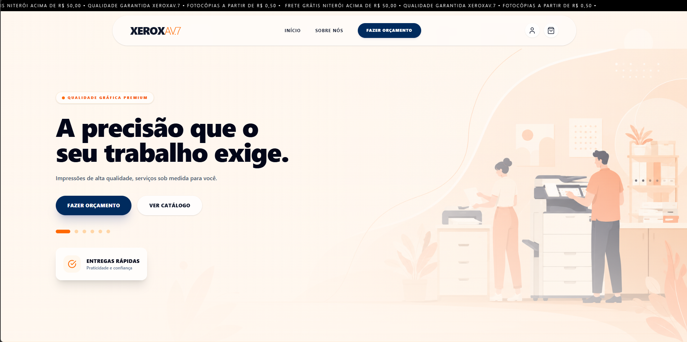
</p>

---

## Catálogo de Produtos e Serviços

Visualização dos serviços e produtos disponíveis para o cliente.

<p align="center">
  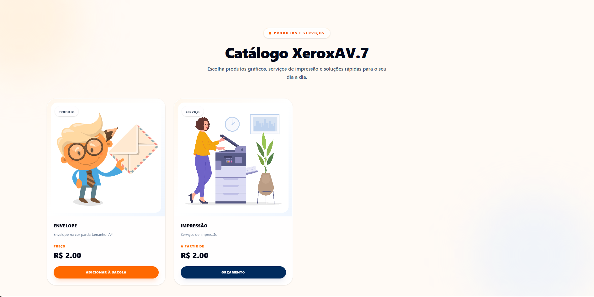
</p>

---

## Solicitação de Orçamento

Fluxo de solicitação de pedidos e orçamento da plataforma.

<p align="center">
  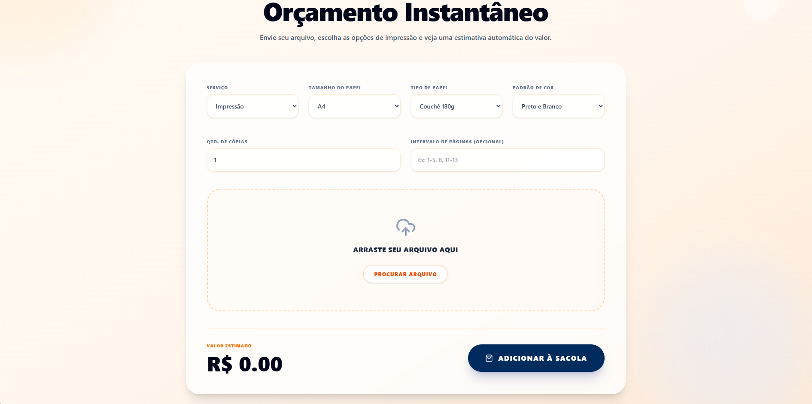
</p>

---

## Área do Cliente

Área destinada ao acompanhamento e gerenciamento das informações do cliente.

<p align="center">
  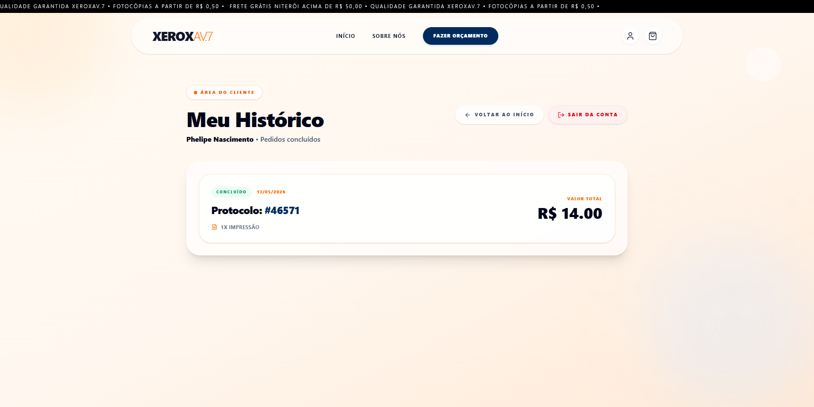
</p>

---

## Painel Administrativo

Visão administrativa central da aplicação para gerenciamento interno.

<p align="center">
  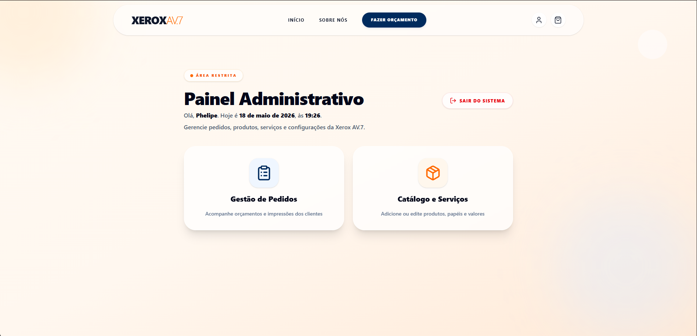
</p>

---

## Gestão de Pedidos

Controle e gerenciamento operacional dos pedidos realizados.

<p align="center">
  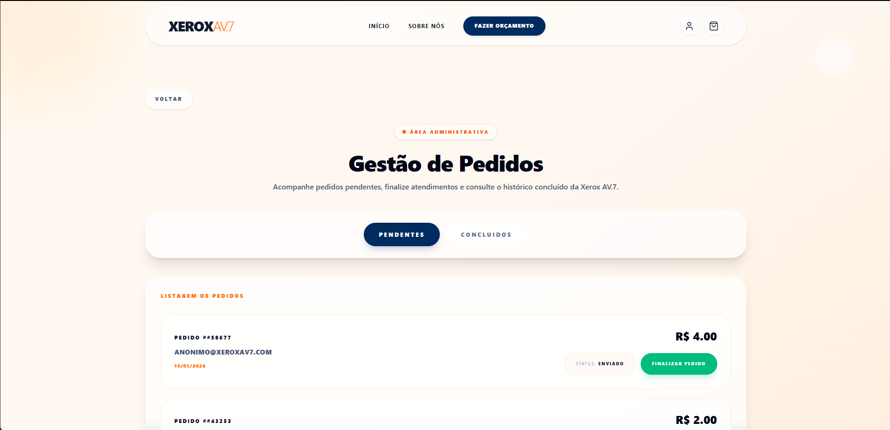
  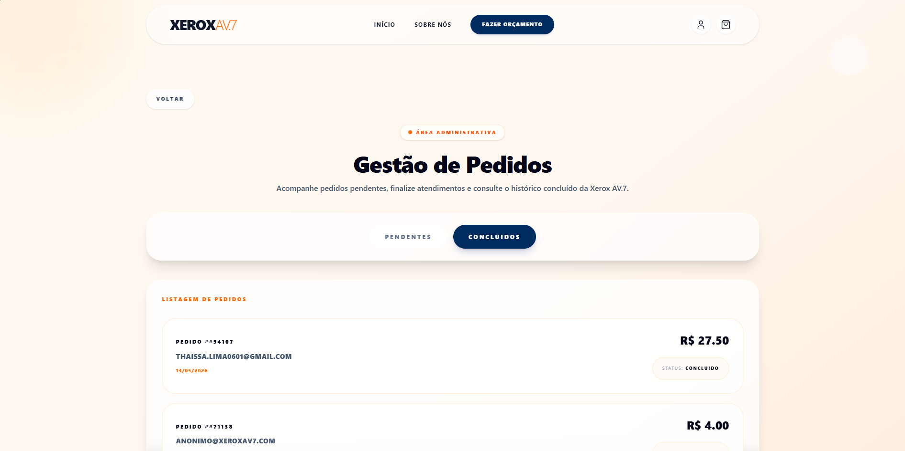
</p>

---

## Gerenciamento do Catálogo

Administração de produtos e serviços disponíveis na plataforma.

<p align="center">
  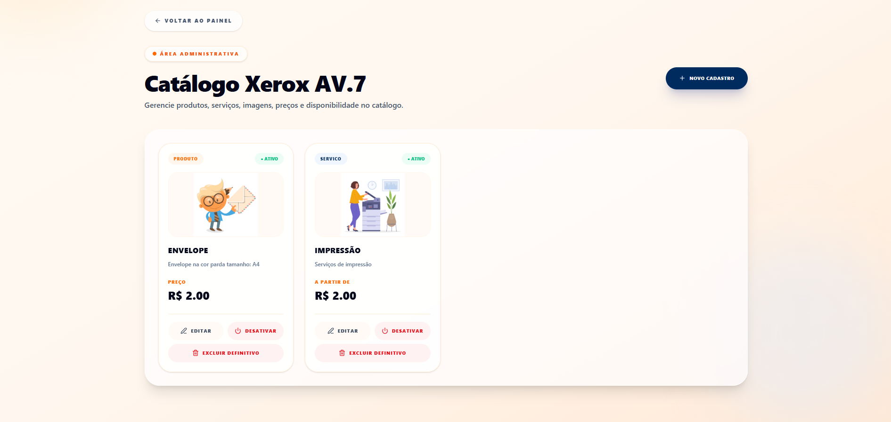
</p>

---

## Cadastro de Produtos e Serviços

Fluxo administrativo para criação e gerenciamento de itens do sistema.

<p align="center">
  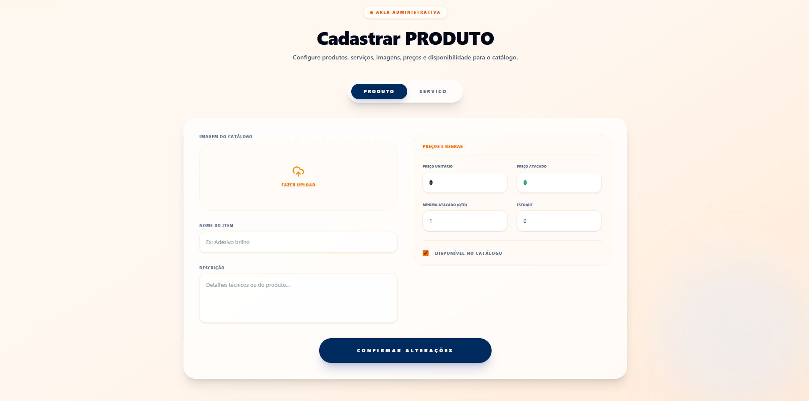
  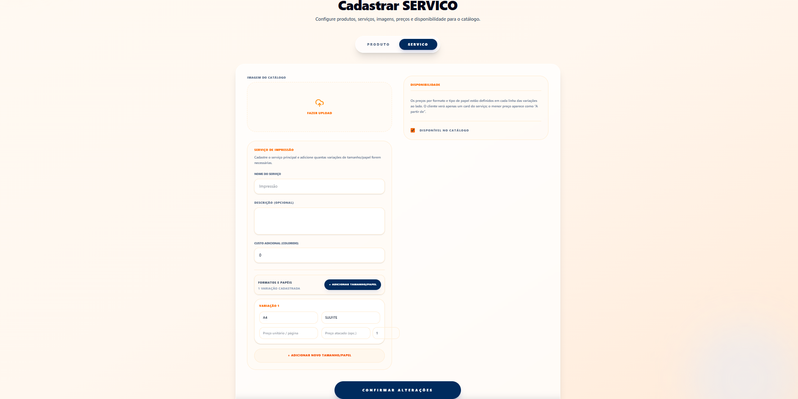
</p>

---

## Sobre a Plataforma

Página institucional apresentando propósito e informações do sistema.

<p align="center">
  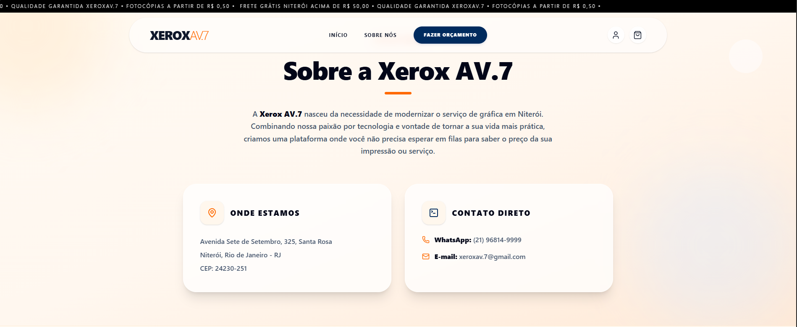
</p>

---

## Identidade Visual e Footer

Elementos finais de navegação e identidade visual da aplicação.

<p align="center">
  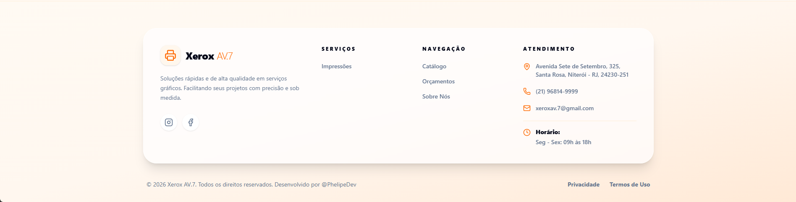
</p>

---

# Projeto Online

## Acesse a plataforma:
👉 https://xeroxav7.tech

---

# Observações Sobre o Repositório

Este repositório possui finalidade demonstrativa e de apresentação profissional do projeto XeroxAV.7.

Parte do código-fonte, regras de negócio internas e detalhes de infraestrutura permanecem privados por questões de propriedade intelectual e estratégia de desenvolvimento.

---

# Status Atual

```diff
+ Projeto em desenvolvimento ativo
+ Ambiente de produção funcionando
+ Melhorias de arquitetura em andamento
```

---

# Próximos Passos

- Evolução para arquitetura mais modular
- Melhorias de performance
- Estudos com microserviços
- Estratégias de cache
- Implementação de CI/CD
- Melhorias de observabilidade
- Recursos assistidos por IA
- Evolução da infraestrutura cloud

---

# Autor

## Phelipe Nascimento

Estudante de Análise e Desenvolvimento de Sistemas com foco em desenvolvimento backend, arquitetura escalável e aplicações full-stack modernas.

### Contato

- LinkedIn: https://www.linkedin.com/in/phelipe-nascimento-
- GitHub: https://github.com/phelipen

---

<p align="center">
  Desenvolvido com foco em engenharia de software, escalabilidade e aprendizado contínuo.
</p>
