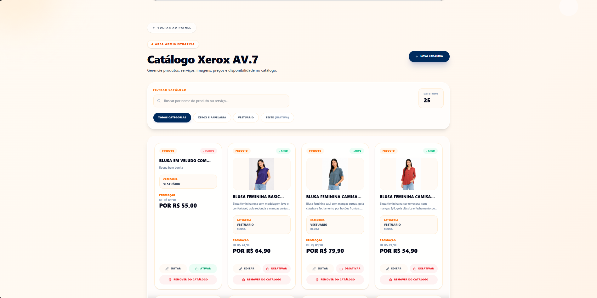
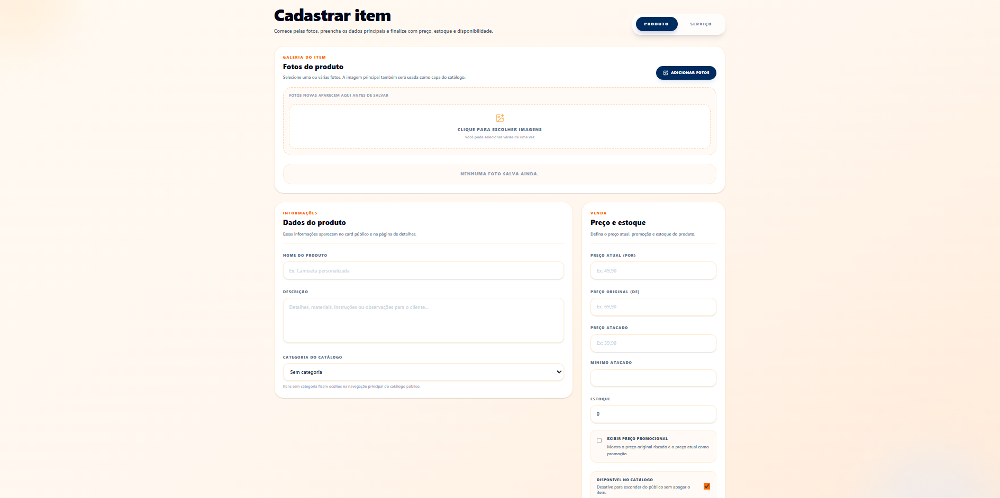
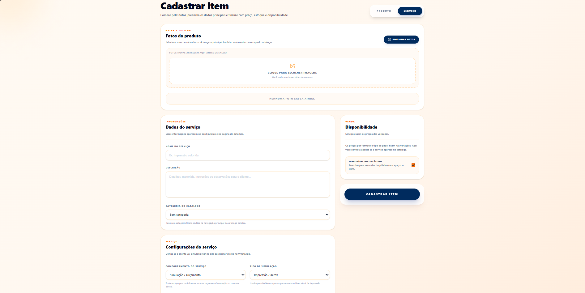

# XeroxAV.7

Aplicação web full-stack desenvolvida para modernizar e otimizar o gerenciamento de serviços gráficos, pedidos e fluxos de atendimento através de uma plataforma responsiva, escalável e orientada para ambiente de produção.

<p align="center">
  <a href="https://xeroxav7.tech">
    
  </a>
  
</p>

---

# Visão Geral

O XeroxAV.7 foi criado com o objetivo de oferecer uma experiência moderna para gerenciamento de serviços gráficos, pedidos e fluxo de clientes, utilizando uma arquitetura robusta e preparada para evolução contínua.

O projeto vem sendo utilizado como principal ambiente de estudo e desenvolvimento prático em áreas como:

- Engenharia de software
- Desenvolvimento backend
- Arquitetura de sistemas
- APIs REST
- Deploy em cloud
- Estruturação full-stack
- Escalabilidade de aplicações

---

# Tecnologias Utilizadas

## Backend
- Java
- Spring Boot
- APIs REST
- JWT Authentication

## Frontend
- React
- JavaScript
- Interface Responsiva

## Banco de Dados
- PostgreSQL
- Modelagem Relacional

## Infraestrutura & DevOps
- Docker
- AWS
- Git & GitHub

---

# Funcionalidades Principais

- Sistema de autenticação
- Gerenciamento de clientes
- Fluxo de pedidos
- Estrutura dinâmica de preços
- Interface responsiva
- Integração completa entre frontend e backend
- APIs RESTful
- Estrutura preparada para escalabilidade
- Ambiente de produção ativo

---

# Objetivos do Projeto

O XeroxAV.7 está em constante evolução com foco em:

- Modularização da arquitetura
- Melhor escalabilidade
- Organização de serviços
- Otimização de performance
- Evolução da infraestrutura
- Automação de fluxos
- Expansão de funcionalidades

---

# Foco de Desenvolvimento

Durante o desenvolvimento deste projeto, o foco principal tem sido o aprimoramento prático em:

- Desenvolvimento backend
- Engenharia de software
- Arquitetura de aplicações
- APIs REST
- Banco de dados
- Estruturação full-stack
- Deploy e infraestrutura cloud
- Conceitos de escalabilidade

---

# Screenshots

## 👤 Visão do Cliente

A experiência do usuário final, desde a navegação inicial até a realização de orçamentos e compras.

### Página Inicial
A primeira experiência do usuário com a plataforma.
<p align="center">
  
</p>

---

### Catálogo de Produtos e Serviços
Navegação fluida pelo catálogo com filtros por categorias (ex: Vestuário, Papelaria).
<p align="center">
  
</p>

---

### Orçamento Instantâneo
Ferramenta core do sistema onde o cliente faz upload do arquivo e o cálculo do valor é feito na hora, com base em tamanho, tipo de papel e cores.
<p align="center">
  
</p>

---

## ⚙️ Painel Administrativo

Área restrita para a gestão completa do negócio, catálogo e pedidos.

### Gestão do Catálogo
Visão geral de todos os produtos e serviços cadastrados, com opções rápidas de filtro, edição e ativação/desativação.
<p align="center">
  
</p>

---

### Cadastro de Produtos e Serviços
Fluxos administrativos dedicados para criação e gerenciamento de itens físicos (com controle de estoque e promoção) e serviços dinâmicos (com simulação de orçamento).
<p align="center">
  
  
</p>

---

### Gestão de Categorias
Controle da organização do catálogo público, permitindo reordenar, criar e desativar seções inteiras.
<p align="center">
  
</p>

---

### Gestão de Pedidos
Acompanhamento em tempo real das solicitações dos clientes, atualização de status e histórico completo dos atendimentos já finalizados.
<p align="center">
  
  
</p>

---

# Projeto Online

## Acesse a plataforma:
👉 https://xeroxav7.tech

---

# Observações Sobre o Repositório

Este repositório possui finalidade demonstrativa e de apresentação profissional do projeto XeroxAV.7.

Parte do código-fonte, regras de negócio internas e detalhes de infraestrutura permanecem privados por questões de propriedade intelectual e estratégia de desenvolvimento.

---

# Status Atual

```diff
+ Projeto em desenvolvimento ativo
+ Ambiente de produção funcionando
+ Melhorias de arquitetura em andamento
